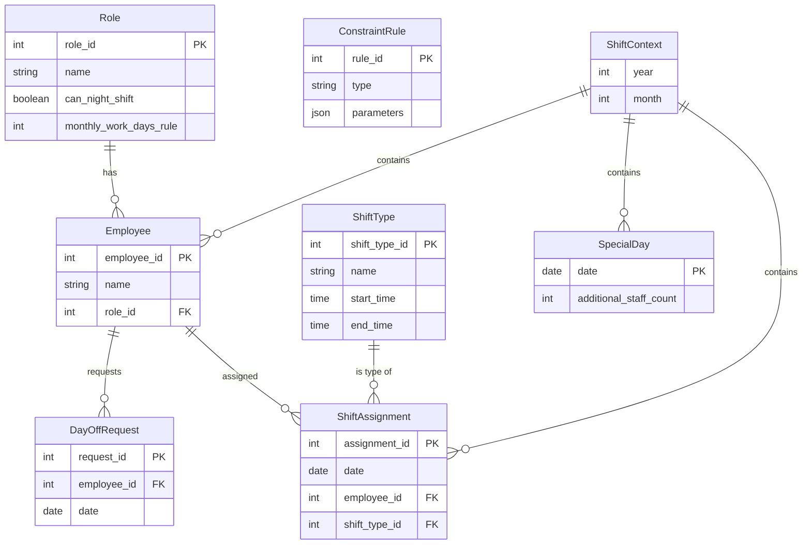

# ER図 (Entity Relationship Diagram)

ShifPita MVPのデータモデルを可視化したER図です。

```mermaid
erDiagram
    %% マスタデータ
    Role {
        int role_id PK
        string name
        boolean can_night_shift
        int monthly_work_days_rule
    }
    ShiftType {
        int shift_type_id PK
        string name
        time start_time
        time end_time
    }
    ConstraintRule {
        int rule_id PK
        string type
        json parameters
    }

    %% トランザクションデータ
    ShiftContext {
        int year
        int month
    }
    Employee {
        int employee_id PK
        string name
        int role_id FK
    }
    DayOffRequest {
        int request_id PK
        int employee_id FK
        date date
    }
    SpecialDay {
        date date PK
        int additional_staff_count
    }
    ShiftAssignment {
        int assignment_id PK
        date date
        int employee_id FK
        int shift_type_id FK
    }

    %% リレーションシップ
    Role ||--o{ Employee : "has"
    Employee ||--o{ DayOffRequest : "requests"
    Employee ||--o{ ShiftAssignment : "assigned"
    ShiftType ||--o{ ShiftAssignment : "is type of"
    ShiftContext ||--o{ SpecialDay : "contains"
    ShiftContext ||--o{ Employee : "contains"
    ShiftContext ||--o{ ShiftAssignment : "contains"
```