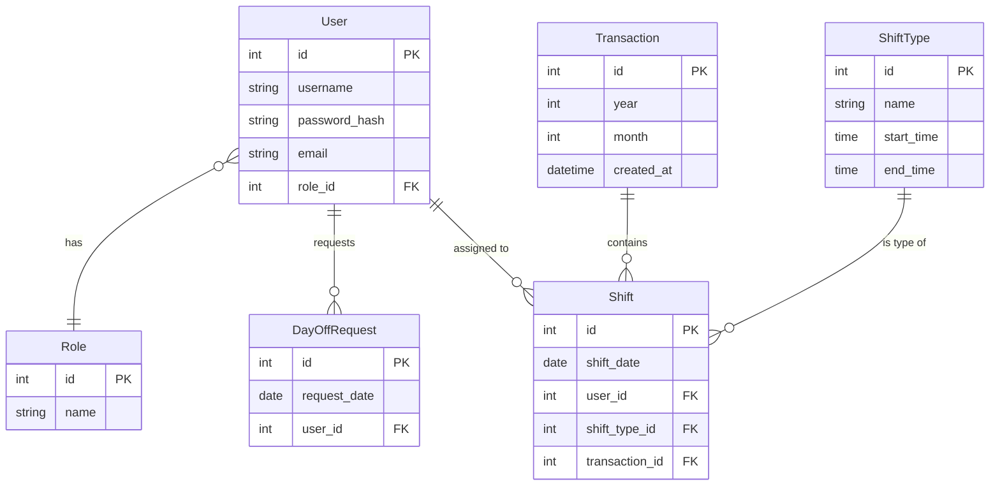

# ER図 (Entity Relationship Diagram)

ShifPita MVPのデータベースモデルを可視化したER図です。
各エンティティ間の詳細な関連や制約については、`relationships.md` を参照してください。

```mermaid
erDiagram
    User {
        int id PK
        string username
        string password_hash
        string email
        int role_id FK
    }
    Role {
        int id PK
        string name
    }
    DayOffRequest {
        int id PK
        date request_date
        int user_id FK
    }
    Transaction {
        int id PK
        int year
        int month
        datetime created_at
    }
    Shift {
        int id PK
        date shift_date
        int user_id FK
        int shift_type_id FK
        int transaction_id FK
    }
    ShiftType {
        int id PK
        string name
        time start_time
        time end_time
    }

    User ||--o{ DayOffRequest : "requests"
    User ||--o{ Shift : "assigned to"
    User }o--|| Role : "has"
    Transaction ||--o{ Shift : "contains"
    ShiftType ||--o{ Shift : "is type of"
```