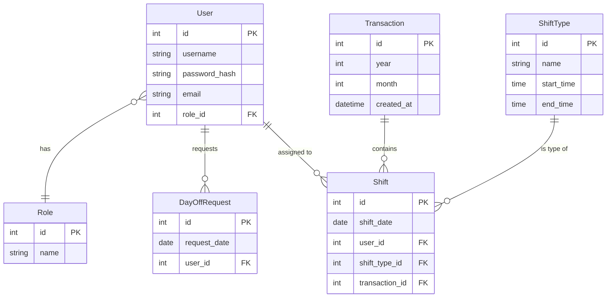

# リレーションシップ設計書

本ドキュメントでは、`entities.md`で定義されたエンティティ間の関係性（リレーションシップ）を定義します。

---

## 1. ER図

---

## 2. リレーションシップ一覧

| 親エンティティ | 子エンティティ | 関係 | 子の外部キー | 説明 |
| :--- | :--- | :--- | :--- | :--- |
| **Role** | **User** | 1:N | `role_id` | 各ユーザーは必ず1つの役割に属します。 |
| **User** | **DayOffRequest** | 1:N | `user_id` | ユーザーが削除された場合、そのユーザーの希望休申請も削除されます (CASCADE)。 |
| **User** | **Shift** | 1:N | `user_id` | ユーザーが削除された場合、そのユーザーのシフトも削除されます (CASCADE)。 |
| **ShiftType** | **Shift** | 1:N | `shift_type_id` | シフトには必ず有効なシフトパターンが必要です。使用中のシフトパターンは削除できません (RESTRICT)。 |
| **Transaction** | **Shift** | 1:N | `transaction_id` | 生成された各シフトは、どの生成履歴に属するかを示します。履歴が削除されたらシフトも削除されます (CASCADE)。 |

---

## 3. ユニーク制約 (Unique Constraints)

| 対象エンティティ | 対象カラム (複合) | 説明 |
| :--- | :--- | :--- |
| **User** | `username` | ユーザー名はシステム全体で一意である必要があります。 |
| **Role** | `name` | 役割名は一意である必要があります。 |
| **ShiftType** | `name` | シフトパターン名は一意である必要があります。 |
| **DayOffRequest**| `user_id`, `request_date` | 1人のユーザーは、同じ日に複数の希望休を申請できません。 |
| **Shift** | `user_id`, `shift_date` | 1人のユーザーは、同じ日に複数のシフトを持つことはできません。 |

