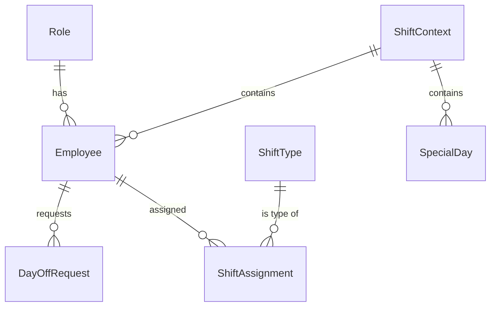

# リレーションシップ設計書

本ドキュメントでは、ShifPita MVPにおけるエンティティ間の関係性（リレーションシップ）を定義します。
本アプリケーションはデータ永続化を行いませんが、メモリ上のデータ構造やJSONデータの整合性を保つための論理的な設計として参照します。

## 1. ER図 (概念モデル)

## 2. リレーションシップ一覧

各エンティティ間の参照関係、およびデータの整合性を保つための制約定義です。

| 親エンティティ (Parent) | 子エンティティ (Child) | 関係 | 外部キー (FK) | 削除制約 (On Delete) | 説明 |
| :--- | :--- | :--- | :--- | :--- | :--- |
| **Role** | **Employee** | 1:N | `role_id` | `RESTRICT` | 従業員は必ず1つの役割を持ちます。役割定義が存在しない従業員は作成できません。 |
| **Employee** | **DayOffRequest** | 1:N | `employee_id` | `CASCADE` | 従業員が削除された場合、その従業員の希望休データも削除されます。 |
| **Employee** | **ShiftAssignment** | 1:N | `employee_id` | `CASCADE` | 従業員が削除された場合、その従業員のシフト割当結果も削除されます。 |
| **ShiftType** | **ShiftAssignment** | 1:N | `shift_type_id` | `RESTRICT` | シフト割当には必ず有効なシフト区分が必要です。使用中のシフト区分は削除できません。 |
| **ShiftContext** | **SpecialDay** | 1:N | `(context_id)` | `CASCADE` | シフト作成コンテキスト（セッション）が破棄されると、設定された特別日も破棄されます。 |

## 3. ユニーク制約 (Unique Constraints)

データの重複を防ぐための複合ユニーク制約の定義です。

| 対象エンティティ | 対象カラム (複合) | 説明 |
| :--- | :--- | :--- |
| **DayOffRequest** | `employee_id`, `date` | 1人の従業員に対して、同じ日に複数の希望休を登録することはできません。 |
| **ShiftAssignment** | `employee_id`, `date` | 1人の従業員に対して、同じ日に複数のシフトを割り当てることはできません。 |
| **SpecialDay** | `date` | 同一のシフト作成コンテキスト内で、同じ日付に対する特別日設定は1つのみです。 |
| **Employee** | `name` | (推奨) 同一のシフト作成コンテキスト内で、従業員名の重複は避けるべきです（ID管理される場合は必須ではありませんが、UI上の混乱を防ぐため）。 |
