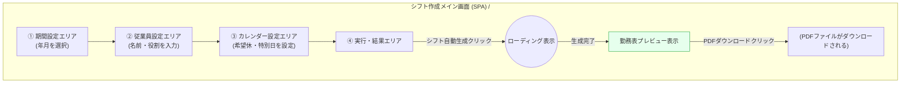

# 画面設計書

このドキュメントは、勤務表自動作成アプリケーションの画面構成と遷移、ルーティングについて定義します。

---

## 1. 画面一覧

本アプリケーションは単一のページで全ての操作が完結するSPA（Single Page Application）として設計します。

| 画面ID    | 画面名             | ルート | 説明                                                                                                                 |
| :-------- | :----------------- | :----- | :------------------------------------------------------------------------------------------------------------------- |
| `SCR-MAIN`  | シフト作成メイン画面 | `/`    | シフト作成に必要な全ての機能（期間設定、従業員管理、希望休設定、シフト生成、結果出力）を統合した単一のページ。 |

---

## 2. 画面遷移図

本アプリケーションはSPAであるため、ページ間の遷移はありません。以下は、メイン画面内でのユーザーの操作フローを示す図です。

---

## 3. アクセス権限マトリックス

現時点では認証機能を導入しないため、全ての画面は公開されます。

| 画面名             | アクセス権限   |
| :----------------- | :------------- |
| シフト作成メイン画面 | `公開 (Public)` |

---

## 4. ルーティング一覧

| ルート (Path) | HTTPメソッド | ルート名 (Name) | 機能概要 | ミドルウェア (Middleware) |
| :------------ | :----------- | :-------------- | :------- | :------------------------ |
| `/` | `GET` | `home` | シフト作成メイン画面（SPA）の表示 | `web` |
| `/api/shifts/generate` | `POST` | `api.shifts.generate` | シフト条件を受け取り、生成されたシフトデータをJSONで返す (F-CO-01) | `api` |
| `/api/shifts/download` | `POST` | `api.shifts.download` | シフトデータを受け取り、PDFファイルを生成して返す (F-CO-02) | `api` |