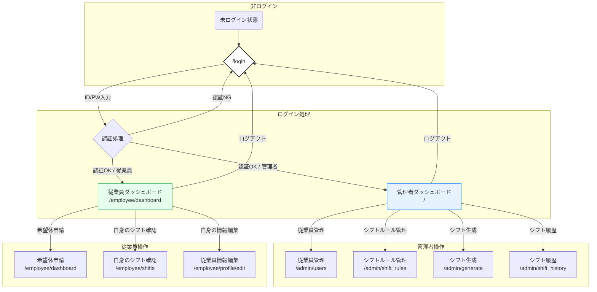

# 画面設計書

このドキュメントは、Webアプリケーション版 ShifPita の画面構成と遷移について定義します。

---

## 1. 画面一覧

本アプリケーションは、ユーザーの役割（管理者・従業員）に応じて表示されるページが変化します。

| 画面ID | 画面名 | URL | 概要 | アクセス権限 |
|---|---|---|---|---|
| SC-01 | ログイン画面 | `/login` | ユーザーがIDとパスワードでログインする | 全員 |
| SC-02 | 管理者ダッシュボード | `/` | 管理者がログイン後に表示される。各管理機能への入口となる。 | 管理者 |
| SC-03 | 従業員管理画面 | `/admin/users` | 従業員の一覧表示と新規登録を行う。 | 管理者 |
| SC-04 | 従業員ダッシュボード | `/` or `/employee/dashboard` | 従業員がログイン後に表示される。希望休の申請やシフト確認を行う。 | 従業員 |
| SC-05 | シフトルール管理画面 | `/admin/shift_rules` | 役割、シフトパターン、固定ルールの管理を行う。 | 管理者 |
| SC-06 | シフト生成画面 | `/admin/generate` | シフト自動生成の実行を行う。 | 管理者 |
| SC-07 | シフト履歴画面 | `/admin/shift_history` | 生成されたシフトの履歴を確認する。 | 管理者 |
| SC-08 | 自身のシフト確認画面 | `/employee/shifts` | 自身の確定シフトを確認する。 | 従業員 |
| SC-09 | 従業員情報編集画面 | `/employee/profile/edit` | パスワード、メールアドレスの変更を行う。 | 従業員 |

---

## 2. 画面遷移図（簡易）

---

## 3. アクセス権限

| 役割 | アクセス可能ページ |
|---|---|
| **未ログインユーザー** | ログイン画面 (`/login`) |
| **管理者** | 全てのページ (管理者ダッシュボード、従業員管理画面など) |
| **従業員** | ログイン画面、従業員専用ページ (従業員ダッシュボードなど) |

---

## 4. ルーティング一覧 (主要なもの)

| ルート (Path) | HTTPメソッド | 機能概要 |
|---|---|---|
| `/login` | `GET`, `POST` | ログイン処理 |
| `/logout` | `GET` | ログアウト処理 |
| `/` or `/index` | `GET` | ログイン後のリダイレクト先 (役割に応じて表示切替) |
| `/admin/users` | `GET`, `POST` | 従業員の追加と一覧表示 |
| `/admin/generate` | `POST` | シフト生成の実行 |
| `/employee/dashboard` | `GET`, `POST` | 希望休の申請と一覧表示 |
| `/employee/day_off/delete/<id>` | `POST` | 希望休の削除 |
| `/admin/shift_rules` | `GET`, `POST` | シフトルール（役割、パターン、固定ルール）の管理 |
| `/admin/shift_history` | `GET` | 生成されたシフトの履歴表示 |
| `/employee/shifts` | `GET` | 自身の確定シフトの確認 |
| `/employee/profile/edit` | `GET`, `POST` | 従業員自身の情報（パスワード、メールアドレス）編集 |

| `/admin/shift_rules` | `GET`, `POST` | シフトルール（役割、パターン、固定ルール）の管理 |
| `/admin/shift_history` | `GET` | 生成されたシフトの履歴表示 |
| `/employee/shifts` | `GET` | 自身の確定シフトの確認 |
| `/employee/profile/edit` | `GET`, `POST` | 従業員自身の情報（パスワード、メールアドレス）編集 |